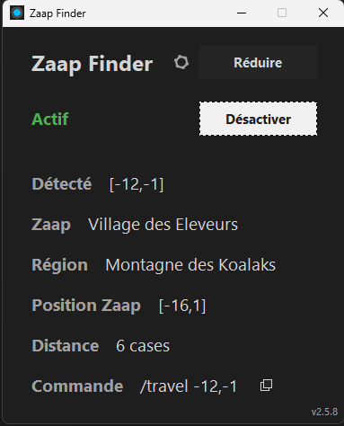
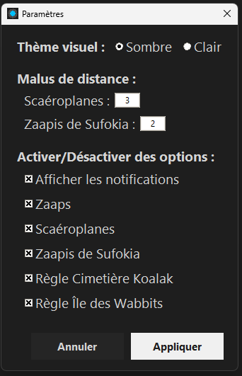

# Zaap Finder pour Dofus

**Note : Cet outil a été conçu avec les données de la version 3.2 de Dofus. Les coordonnées peuvent ne pas être à jour pour les versions plus récentes du jeu.**

Un utilitaire pour les joueurs de Dofus qui surveille le presse-papiers. Dès qu'une coordonnée (`x,y`) est copiée, l'outil la remplace automatiquement par la commande de voyage `/travel` la plus optimisée.

## Cas d'utilisation principal : La chasse aux archimonstres

Cet outil a été créé pour un objectif précis : arriver le plus vite possible sur la carte d'un archimonstre signalé par un bot (ex: Jitsuri). Le workflow est optimisé pour la vitesse :

> Un bot signale une position ➔ Vous copiez la coordonnée ➔ Une notification Windows vous indique le Zaap le plus proche ➔ En jeu : téléportation au zaap, selectionnez le chat (`espace`), collez la commande (`Ctrl+V`) et validez (`entrée`*2).

L'interface graphique affiche les détails du trajet et permet de récupérer la commande manuellement à tout moment.

## Fonctionnalités

* **Surveillance Automatique** : Détecte les coordonnées dans le presse-papiers en temps réel.
* **Optimisation Intelligente** : Calcule le point de départ le plus proche (Zaap, Scaéroplane, Zaapi) en tenant compte des malus de distance et des zones spécifiques (Wabbit, Cimetière Koalak, etc.).
* **Remplacement Automatique** : Remplace la coordonnée copiée par la commande `/travel` correspondante.
* **Interface Claire** : Affiche les détails du dernier trajet calculé (coordonnée détectée, Zaap de départ, distance, etc.).
* **Personnalisable** : Paramètres pour ajuster les malus de distance, activer/désactiver certains types de transport, et choisir entre un thème sombre ou clair.
* **Discret** : Peut être réduit dans la zone de notification pour tourner en arrière-plan.

## Aperçu

Voici à quoi ressemblent l'interface principale et la fenêtre des paramètres :


*Interface principale en mode sombre, affichant le dernier trajet calculé.*


*Fenêtre des paramètres, permettant de personnaliser le comportement de l'outil.*

### Fonctionnement en temps réel

Lorsque l'application est **"Active"** et que vous copiez une coordonnée en jeu (par exemple `-12,-1`), elle effectue trois actions instantanément :

1. **Mise à jour du presse-papiers** : Elle remplace la coordonnée dans votre presse-papiers par la commande d'autopilote optimisée (ex: `/travel -12,-1`). Vous n'avez plus qu'à la coller en jeu.
2. **Notification Windows** : Elle affiche une notification discrète vous indiquant le nom du Zaap de départ le plus proche (ex: "Village des Eleveurs").
3. **Mise à jour de l'interface** : Elle rafraîchit l'affichage pour vous donner tous les détails du trajet (distance, position du Zaap, etc.).

---

## Guide de Démarrage (pour la plupart des utilisateurs)

Cette méthode utilise l'exécutable (`.exe`) pré-compilé et ne nécessite pas d'installer Python.

1. Allez sur la [**Page des Releases**](https://github.com/BurN-30/zaap-finder/releases).
2. Téléchargez le fichier `.zip` de la dernière version et décompressez `zaap_finder.exe` dans un nouveau dossier.
3. Lancez `zaap_finder.exe`. **L'application est immédiatement fonctionnelle avec les paramètres par défaut.**

### Personnalisation (Optionnel)

* Pour modifier les options (thème, malus de distance, etc.), cliquez sur l'icône d'engrenage ⚙️ dans l'application.
* Lorsque vous cliquerez sur **"Appliquer"**, un fichier `zaap_finder_settings.json` sera créé dans le même dossier que l'exécutable.
* Ce fichier sauvegardera vos préférences pour les prochaines fois que vous lancerez l'application.

---

## Installation pour Développeurs (depuis le code source)

Cette méthode est pour les utilisateurs qui souhaitent exécuter le script directement avec Python.

### 1. Cloner et Installer les Dépendances

1. **Clonez le dépôt :**
        ```bash
    git clone https://github.com/BurN-30/zaap-finder.git
    cd zaap-finder
        ```
2. **Créez un environnement virtuel (recommandé) :**
        ```bash
    python -m venv venv
        ```
3. **Activez l'environnement virtuel :**
    * **Windows :** `.\venv\Scripts\activate`
    * **macOS/Linux :** `source venv/bin/activate`
4. **Installez les dépendances :**
        ```bash
    pip install -r requirements.txt
        ```

#### 2. Lancer le Script

Assurez-vous que `icon.ico` est dans le même dossier, puis exécutez le script :
    ```bash
python zaap_finder.py
    ```

---

## Créer un Exécutable

Pour créer votre propre fichier `.exe`, vous pouvez utiliser PyInstaller. Le nom du script est maintenant `zaap_finder.py`.

1. **Installez PyInstaller :**
        ```bash
    pip install pyinstaller
        ```
2. **Créez l'exécutable (commande importante) :**
        ```bash
    pyinstaller --onefile --windowed --add-data "icon.ico;." --name="zaap_finder" zaap_finder.py
        ```
    * `--add-data "icon.ico;."` est **essentiel** pour inclure votre icône.
    * `--name="zaap_finder"` permet de nommer votre exécutable `zaap_finder.exe`.

L'exécutable se trouvera dans le dossier `dist`.

---

## ⚠️ Avertissement (Disclaimer)

**Utilisez cet outil à vos propres risques.** L'utilisation d'outils tiers, même ceux qui n'interagissent pas directement avec le client du jeu, peut être contraire aux Conditions Générales d'Utilisation (CGU) d'Ankama. En utilisant ce script, vous assumez l'entière responsabilité des conséquences potentielles, y compris la suspension ou le bannissement de votre compte.

Ce projet a été développé à des fins personnelles et éducatives. Il n'est pas commercialisé et n'est affilié d'aucune manière à Ankama.

## Maintenance

Ce script a été créé pour répondre à un besoin personnel sur une période donnée. Par conséquent, **sa maintenance n'est pas garantie**. Les données (comme les coordonnées des Zaaps) peuvent devenir obsolètes après une mise à jour majeure du jeu.

## Contributions

Bien que ce projet soit principalement destiné à un usage personnel, les contributions sont les bienvenues. N'hésitez pas à ouvrir une *issue* pour discuter d'un bug ou proposer une amélioration.
